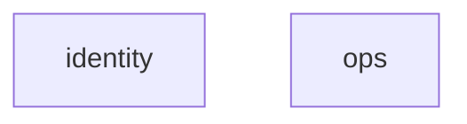

# Module map

<!-- Generated by tools/gen_module_map.py (ARCH-02). Do not edit by hand. -->

Modules in mount order: each module is mounted after the modules it depends on.
Regenerate with `uv run python tools/gen_module_map.py`.

| Order | Module | Context | Depends on |
|---|---|---|---|
| 1 | `identity` | identity | none |
| 2 | `ops` | platform | none |

## Dependencies

An arrow `a --> b` means module a depends on b.

