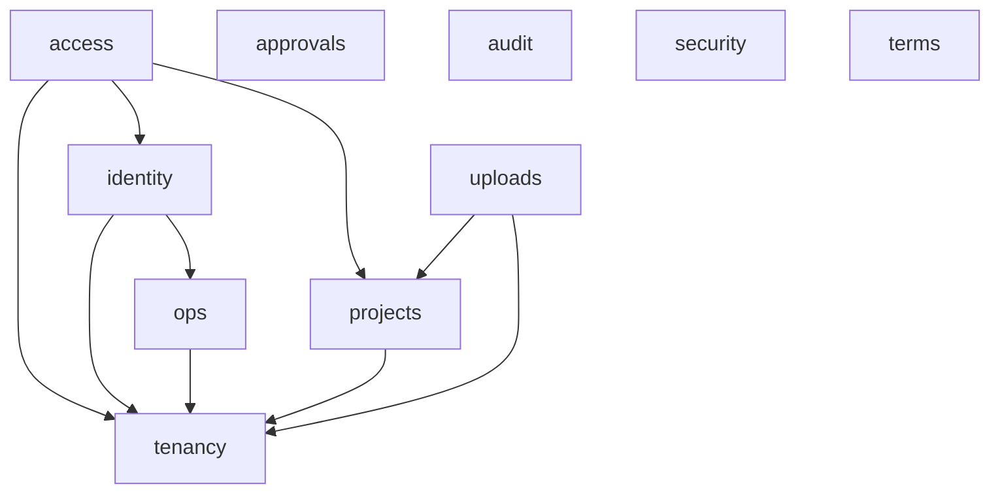

# Module map

<!-- Generated by tools/gen_module_map.py (ARCH-02). Do not edit by hand. -->

Modules in mount order: each module is mounted after the modules it depends on.
Regenerate with `uv run python tools/gen_module_map.py`.

| Order | Module | Context | Depends on |
|---|---|---|---|
| 1 | `approvals` | approvals | none |
| 2 | `audit` | audit | none |
| 3 | `security` | security | none |
| 4 | `tenancy` | tenancy | none |
| 5 | `ops` | platform | `tenancy` |
| 6 | `identity` | identity | `ops`, `tenancy` |
| 7 | `projects` | projects | `tenancy` |
| 8 | `access` | identity | `identity`, `projects`, `tenancy` |
| 9 | `terms` | terms | none |
| 10 | `uploads` | uploads | `projects`, `tenancy` |

## Dependencies

An arrow `a --> b` means module a depends on b.

```mermaid
graph TD
    access --> identity
    access --> projects
    access --> tenancy
    approvals
    audit
    identity --> ops
    identity --> tenancy
    ops --> tenancy
    projects --> tenancy
    security
    tenancy
    terms
    uploads --> projects
    uploads --> tenancy
```
